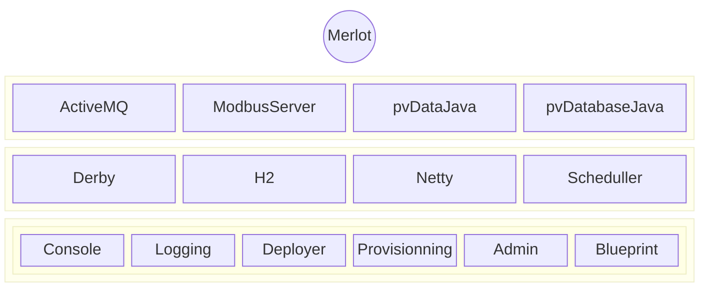

# Merlot

Merlot (Karaf Automation), is a conceptualization and implementation of a communications gateway for automating processes using open source tools. Merlot is based on Karaf [1] a container of objects and Java applications based on the OSGi [2] technology.

Some years ago we participated in the development of a communication gateway between the APACS / Quadlod Moore (now Siemens) controllers, and a custom user SCADA, using the MODBUS protocol. 

The aim was to establish a migration path for these devices starting with the SCADA, which as design criteria should use the MODBUS / TCP protocol. The number of tags for the entire plant was above 40K points. After researching the different architectures and object containers development, it was selected as OSGI architecture and existing containers Karaf is selected. This concept remained outside the scope of services offered by NIM gateway supplied by Siemens for use 4mmation and migration route via OPC.

To date, the gateway is fully functional operating 24/7 for the past four years, so this is a concept already proven in the field.

And having defined the concept of Merlot, I will indicate the main components associated to the gateway, functionality and location of the component where you can access the individual manuals for each.

While Karaf provides a set of functionality that saves a significant amount of time from the point of view of architecture,we need incoporporte to Merlot  the tools to make connections with our field devices (aka PLC or RTU).

Karaf provides a methodology for incorporating these features using the  "feature servie" where each "feature" allows the incorporation of his own bundles required and automatically solve his  dependencies.

The above diagram shows a summary of the different components of Merlot, which we describe below:  

**Scheduler [1]**: is the component for scheduling tasks within Merlot. Karaf provides a "feature" that allows transparently urge as well as an OSGi service to the planned execution of tasks. This will be our next item of business.

**ActiveMQ [2]**: This is a broker for messaging, supports multiple protocols (MQTT) for the server and client libraries for multiple languages. ActiveMQ is the key to the integration of components based on IoT base.

**Virtual Device**: Since the aim of Merlot is to serve as a gateway for communication in process automation, the model of virtual devices associated with Merlot will be based on a MODBUS device type records. This concept will be used for shared memory model between the various components.

**Netty [3]**: This library enables the development of high-performance servers and very efficient in the management of host resources.

**MODBUS Server**: access to Merlo from field devices, either from a PLC, SCADA or HMI, can be performed using this protocol, one of the simplest and most used in industry. The server will be based on so Netty is expected to be very efficient in performance.

**RTB (Real Time Database)**: I think this is a more complicated and difficult to implement parts. It is important to note that at no time think will reinvent the wheel in this regard, so we'll use a project called pvIOCJava, developed for the EPICS project. There are tons of documents, presentations and tutorials. In another publication of the blog  we will summarize these services

**H2 [4]**: For data persistence and Remote Access configuration will use this database. The evaluations resource consumption is minimal so it is my leading candidate. The implementation of the database is done using JPA, so persistence is actually transparent.

**pvDataBaseJava [5]**: The component for the development of the database in real time (soft real time). It is a set of libraries and applications that allows access to the database through the CA V3 protocol, developed in the EPICS project.

**Device Manager**: the manager devices is the service responsible for linking devices (dev) with their respective drivers (DRV). Connecting our PLC or RTU passes by this component. Like the rest of the service to be developed it is based on OSGi, so that the development process is standardized.

[1]: https://quartz-scheduler.org/
[2]: http://activemq.apache.org/
[3]: http://netty.io/
[4]: http://www.h2database.com/html/main.html
[5]: http://www.aps.anl.gov/epics/

